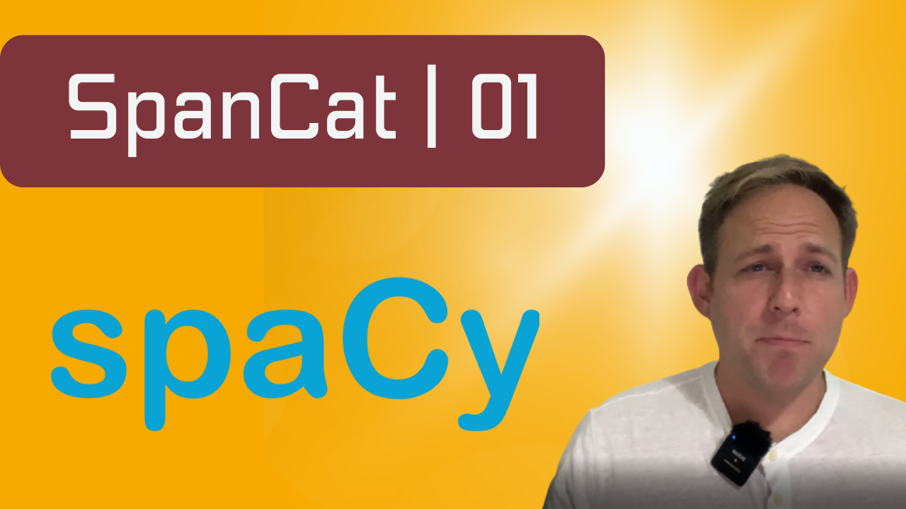

# About Repository

This repository holds the notebooks and data for my YouTube series on SpanCat and spaCy. It walks students through an entire project based around data from a newspaper called Focus. The purpose of this project is to cultivate data, annotate it, train a model, test the model, and create a Streamlit front-end application. This video series is still in production. Stay tuned for updates.

